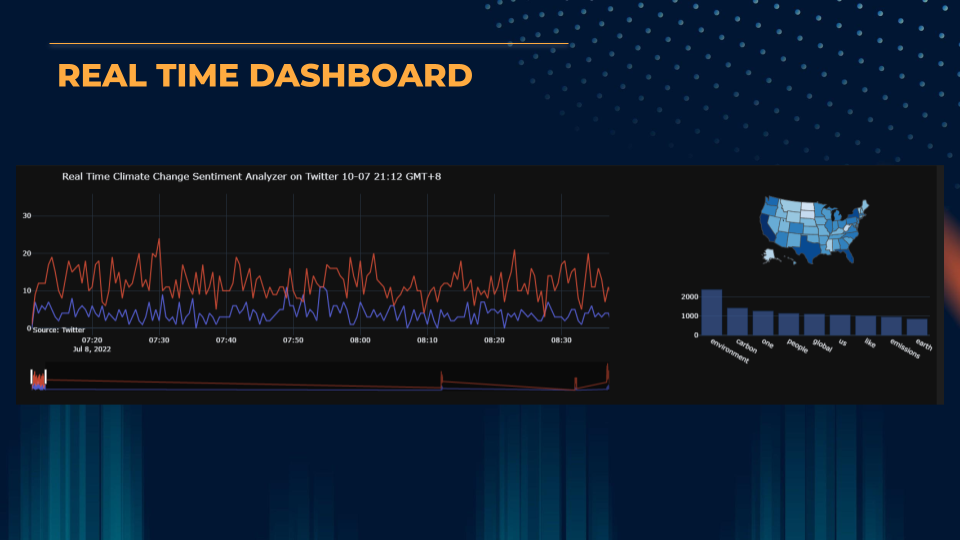

# Climate-Change-Real-Time-Twitter-Dashboard

This real time dashboard scrapes Twitter tweets instantaneously, analyses them, and updates itself in a dashboard to identify the sentiment of conversation regarding climate change. To achieve the desired results, sample data was collected over a period to test the efficacy 
and accuracy of the data. The real-time dashboard includes features such as:

1. Line graph to indicate the number of positive and negative sentiments every 30 seconds
2. A toggle bar to enable the ability to navigate between the different timelines and zoom in
3. A mapping of all the climate tweets sent out in the United States. The states are highlighted based on the number of tweets. The darker the blue, the greater the number of tweets sent out
4. A bar chart to include the frequently used words.

The data scraped from Twitter is stored locally in a MySQL database. The files required as follows:

1. settings.py -> Includes the track words, table names and the type of attributes that is derived from each Tweet
2. credentials.py -> Includes the API_KEY, API_SECRET_KEY, ACCESS_TOKEN, ACCESS_TOKEN_SECRET
3. analysis3rd.ipynb -> The Sentiment Analysis process and real time dashboard 
4. main2.ipynb -> Twitter Scraper with the connection and storing to the MySQL database
